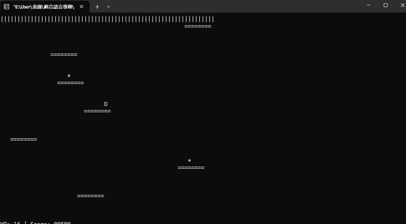
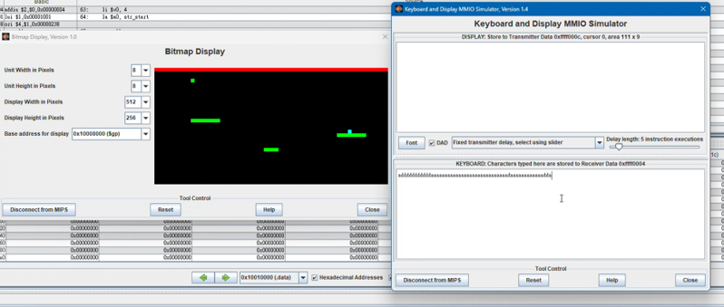

# Introduction
NS-Shaft: A Hybrid Implementation in C & MIPS Assembly
This project is a recreation of the classic arcade game "NS-Shaft" (commonly known as "Little Kids Downstairs"). Developed as a final project for the Assembly Language course, this repository showcases two distinct implementations: a high-level version in C featuring Double Buffering to eliminate screen flickering, and a low-level version in MIPS Assembly. The project emphasizes the integration of fundamental data structures, such as Stacks for position backtracking, and hardware-level interactions through MMIO (Memory-Mapped I/O).

# How to Play
The objective is to survive as long as possible by navigating the character through an endless series of rising platforms.

Controls: Use the 'A' and 'D' keys to move the character left and right.

Survival: Avoid hitting the spikes on the ceiling and prevent falling into the void at the bottom.

Health & Respawns: The player has 4 HP. If you fall into the void, the game utilizes a Stack-based backtracking system to respawn the character at the last successfully touched platform.

Bonuses: Platforms have a 30% chance to spawn stars. Collecting 4 stars restores 1/4 of your health and awards 500 bonus points.

# Environment & Execution
To ensure the game runs correctly, please set up the following environments:

For the C Implementation:
Compiler: Any standard C compiler (e.g., GCC, MinGW).

Platform: Windows Console (utilizes conio.h for _getch() and Windows API for gotoxy() and HideCursor()).

For the MIPS Implementation:
Simulator: MARS (MIPS Assembler and Runtime Simulator) is highly recommended.

Required Tools:

Bitmap Display:

Unit Width/Height: 8

Display Width/Height: 512

Base Address: 0x10080000 (Global Data)

Keyboard and Display MMIO Simulator: Must be connected to the MIPS kernel to capture real-time input.

### 遊戲執行截圖

